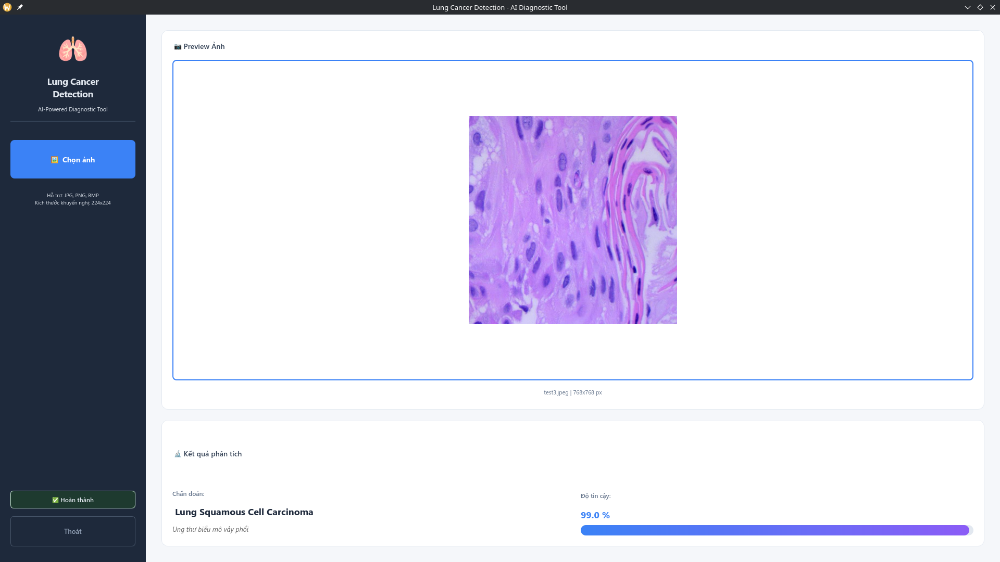

<div align="center">

# 🫁 Lung Cancer Detection using VGG16

[](https://python.org)
[](https://tensorflow.org)
[](https://doc.qt.io/qtforpython/)
[](LICENSE)

**AI-powered desktop application for lung cancer detection from CT scan images using Convolutional Neural Networks (CNN)**

[Features](#-features) •
[Installation](#-installation) •
[Usage](#-usage) •
[Model](#-model-architecture) •
[Dataset](#-dataset) •
[Contributing](#-contributing)



</div>

---

## Table of Contents

- [Features](#-features)
- [Requirements](#-requirements)
- [Installation](#-installation)
- [Usage](#-usage)
- [Model Architecture](#-model-architecture)
- [Dataset](#-dataset)
- [Project Structure](#-project-structure)
- [API Reference](#-api-reference)
- [Contributing](#-contributing)
- [License](#-license)

---

## Features

- **Modern GUI** - Clean and intuitive interface built with PySide6 (Qt6)
- **Deep Learning** - CNN-based classification using TensorFlow/Keras
- **Multi-class Detection** - Identifies 3 types of lung conditions:  
  -- Lung Adenocarcinoma (Ung thư biểu mô tuyến phổi)  
  -- Lung Squamous Cell Carcinoma (Ung thư biểu mô vảy phổi)  
  -- Normal Lung (Phổi bình thường)
- **Non-blocking Inference** - Background processing with threaded AI worker
- **Confidence Score** - Displays prediction confidence percentage
- **Multiple Formats** - Supports JPG, JPEG, PNG, BMP, TIFF, WebP images
- **Bilingual Support** - Vietnamese and English labels

---

## Requirements

### System Requirements

| Component | Minimum                              | Recommended                |
| --------- | ------------------------------------ | -------------------------- |
| OS        | Windows 10 / Ubuntu 20.04 / macOS 11 | Latest LTS versions        |
| Python    | 3.12+                                | 3.12+                      |
| RAM       | 8 GB                                 | 16 GB                      |
| GPU       | -                                    | NVIDIA CUDA-compatible GPU |
| Storage   | 2 GB                                 | 5 GB                       |

### Dependencies

```txt
keras>=3.0.0
matplotlib>=3.10.8
numpy>=2.2.6
opencv-python>=4.12.0.88
pillow>=10.0.0
pyside6>=6.6.0
scikit-learn>=1.8.0
seaborn>=0.13.2
tensorflow[and-cuda]>=2.20.0
```

---

## Installation

### Option 1: Using pip (Recommended)

```bash
# Clone the repository
git clone https://github.com/yourusername/lung-detect.git
cd lung-detect

# Create virtual environment
python -m venv .venv
source .venv/bin/activate  # Linux/macOS
# .venv\Scripts\activate   # Windows

# Install dependencies
pip install -e .
```

### Option 2: Using uv (Fast Package Manager)

```bash
# Clone the repository
git clone https://github.com/yourusername/lung-detect.git
cd lung-detect

# Install with uv
uv sync
```

### Verify Installation

```bash
# Run the application
lung-detect

# Or directly with Python
python -m src.main
```

---

## Usage

### Running the Application

```bash
# Using the installed command
lung-detect

# Or using Python module
python -m src.main
```

### Application Workflow

1. **Launch** the application
2. **Select Image** - Click "Chọn ảnh" to load a CT scan image
3. **Automatic Analysis** - The AI model processes the image automatically
4. **View Results** - See the diagnosis and confidence score

### Programmatic Usage

```python
from src.core.ai_worker import AIWorker

# Create AI worker
worker = AIWorker(
    image_path="/path/to/ct_scan.jpg",
    model_path="lung_cancer_model_ver2.keras"
)

# Connect signals
worker.prediction_ready.connect(lambda label, conf: print(f"{label}: {conf}%"))
worker.error_occurred.connect(lambda err: print(f"Error: {err}"))

# Start inference
worker.start()
worker.wait()
```

---

## Model Architecture

### Overview

The model is based on **VGG16** architecture, fine-tuned for lung cancer classification.

| Layer                  | Output Shape  | Parameters |
| ---------------------- | ------------- | ---------- |
| Input                  | (224, 224, 3) | 0          |
| VGG16 Base             | (7, 7, 512)   | 14,714,688 |
| Global Average Pooling | (512,)        | 0          |
| Dense (256, ReLU)      | (256,)        | 131,328    |
| Dropout (0.5)          | (256,)        | 0          |
| Dense (3, Softmax)     | (3,)          | 771        |

**Total Parameters:** ~14.8M  
**Input Size:** 224 × 224 × 3 (RGB)  
**Output:** 3 classes with softmax probabilities

### Training Details

- **Optimizer:** Adam (lr=1e-4)
- **Loss:** Categorical Crossentropy
- **Metrics:** Accuracy, Precision, Recall
- **Epochs:** 50 with Early Stopping
- **Batch Size:** 32
- **Data Augmentation:** Rotation, Flip, Zoom, Brightness

### Model Files

| File                           | Description                        |
| ------------------------------ | ---------------------------------- |
| `lung_cancer_model_ver2.keras` | Latest trained model (recommended) |
| `lung_cancer_model.keras`      | Initial model version              |
| `lung_cancer_model_ver2.h5`    | H5 format backup                   |

---

## Dataset

### Structure

```
LungCancer/
├── lung_adenocarcinomas/        # Adenocarcinoma samples
├── lung_normal/                 # Normal lung samples
└── lung_squamous_cell_carcinomas/  # Squamous cell carcinoma samples
```

### Classes

| Class                        | Description                         | Vietnamese                 |
| ---------------------------- | ----------------------------------- | -------------------------- |
| Lung Adenocarcinoma          | Most common type of lung cancer     | Ung thư biểu mô tuyến phổi |
| Lung Squamous Cell Carcinoma | Cancer in flat cells lining airways | Ung thư biểu mô vảy phổi   |
| Lung Normal                  | Healthy lung tissue                 | Phổi bình thường           |

### Data Source

The dataset is based on histopathological images from the [LC25000 dataset](https://www.kaggle.com/datasets/andrewmvd/lung-and-colon-cancer-histopathological-images).

---

## Project Structure

```
lung-detect/
├── 📄 pyproject.toml           # Project configuration
├── 📄 README.md                # Documentation
├── 📄 main.py                  # Alternative entry point
│
├── 📁 src/                     # Source code
│   ├── 📄 __init__.py
│   ├── 📄 main.py              # Application entry point
│   │
│   ├── 📁 core/                # Core modules
│   │   ├── 📄 __init__.py
│   │   └── 📄 ai_worker.py     # AI inference worker thread
│   │
│   └── 📁 ui/                  # User interface
│       ├── 📄 __init__.py
│       └── 📄 main_window.py   # Main window UI
│
├── 📁 assets/                  # Static assets
│   └── 📄 styles.qss           # Qt stylesheets
│
|── 📁 LungCancer/              # Dataset directory
    ├── 📁 lung_adenocarcinomas/
    ├── 📁 lung_normal/
    └── 📁 lung_squamous_cell_carcinomas/
```

---

## API Reference

### `AIWorker` Class

Thread-safe AI inference worker.

```python
class AIWorker(QThread):
    """Background worker for AI model inference."""

    # Signals
    prediction_ready = Signal(str, float)  # (label, confidence%)
    error_occurred = Signal(str)           # error message
    progress_updated = Signal(str)         # status message
```

#### Constructor

```python
AIWorker(
    image_path: str,       # Path to input image
    model_path: str,       # Path to .keras model file
    parent: QObject = None
)
```

#### Methods

| Method     | Description                          |
| ---------- | ------------------------------------ |
| `start()`  | Begin inference in background thread |
| `cancel()` | Cancel pending operation             |
| `wait()`   | Block until thread completes         |

### `MainWindow` Class

Main application window with modern UI.

```python
class MainWindow(QMainWindow):
    """Main application window."""

    SIDEBAR_WIDTH = 280
    WINDOW_MIN_WIDTH = 1000
    WINDOW_MIN_HEIGHT = 700
```

---

## Testing

```bash
# Install dev dependencies
pip install -e ".[dev]"

# Run tests
pytest

# Run with coverage
pytest --cov=src --cov-report=html
```

---

## Contributing

Contributions are welcome! Please follow these steps:

1. **Fork** the repository
2. **Create** a feature branch
   ```bash
   git checkout -b feature/amazing-feature
   ```
3. **Commit** your changes
   ```bash
   git commit -m 'Add amazing feature'
   ```
4. **Push** to the branch
   ```bash
   git push origin feature/amazing-feature
   ```
5. **Open** a Pull Request

### Code Style

- Follow [PEP 8](https://pep8.org/) style guide
- Use type hints for all functions
- Write docstrings in Google style
- Maximum line length: 100 characters

---

## Disclaimer

> **Important:** This application is intended for **educational and research purposes only**. It should **NOT** be used as a substitute for professional medical diagnosis. Always consult qualified healthcare professionals for medical advice.

---

## License

This project is licensed under the MIT License - see the [LICENSE](LICENSE) file for details.

---

## Acknowledgments

- [TensorFlow](https://tensorflow.org) - Deep learning framework
- [PySide6](https://doc.qt.io/qtforpython/) - Qt for Python
- [LC25000 Dataset](https://www.kaggle.com/datasets/andrewmvd/lung-and-colon-cancer-histopathological-images) - Training data
- [VGG16](https://arxiv.org/abs/1409.1556) - Base model architecture

---

<div align="center">

**Made with ❤️ for healthcare**

[⬆ Back to Top](#-lung-cancer-detection-using-VGG16)

</div>
